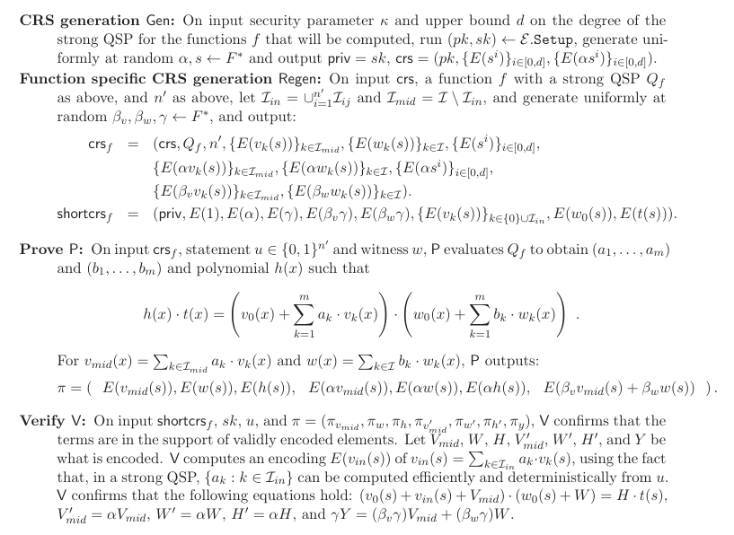

## background
- KEA: (x,y) is a alpha-pair, for example, y = alpha x. To construct another alpha-pair, the easy way is (xbar, ybar) where xbar = beta x, and ybar = beta y. The KEA assumption is that it's the only feasible way to do it.

- to hide {ai}, prover just sends \sum ai vi(s)

- to prevent cheating, the prover must construct an alpha-pair from {vi(s), alpha vi(s)}.

- verify KEA: given g^vmid(s), g^{alpha vmid(s)}, and g^alpha, we check if 
    > e(g^{alpha vmid(s)}, g) = e(g^{vmid(s)}, g^alpha)

## GGPR

- `crs`:  
    - g^{s^i}, g^{alpha s^i} => h(s) is constructed from a polynomial.

    - g^{vi(s)}, g^{alpha vi(s)} => vmid(s) is linear combination of 
    {vi{s}}.

    - g^{wi(s)}, g^{alpha wi(s)} => w(s) is linear combination of {wi(s)}.

- gen proof: 
    - (g^vmid(s), g^{alpha vmid(s)}

      g^vmid(s) = prod g^{ai vi(s)} where g^{ai vi(s)} = (g^vi(s))^{ai}

    - (g^w(s), g^{alpha w(s)})

    - (g^h(s), g^{alpha h(s)})

- verify proof: 
    - e(g^{alpha vmid(s)}, g) = e(g^{vmid(s)}, g^alpha)

    - e(g, g^{alpha w(s)}) = e(g^alpha, g^{w(s)})

    - e(g^{alpha h(s)}, g) = e(g^{h(s)}, g^alpha)

    - h(s) x t(s) == v(s) x w(s) <=> e(g^v(s), g^w(s)) = e(g^h(s), g^t(s))